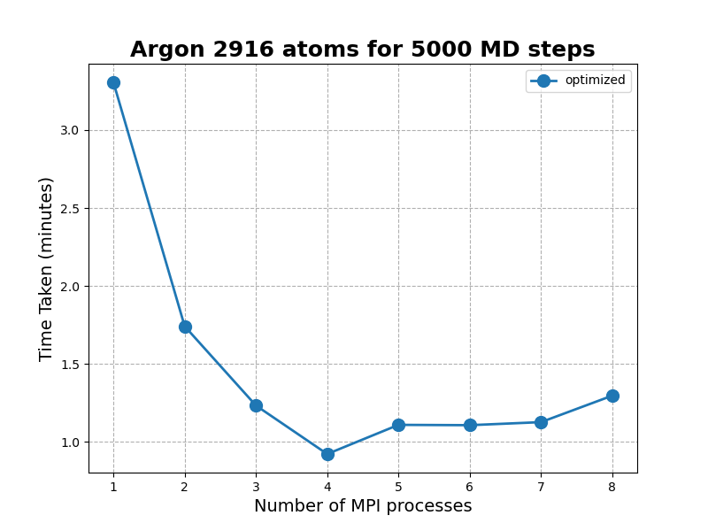

# Report for the LJMD Project
This report outlines the approach taken to benchmark the LJMD code and presents the corresponding findings. The benchmarking process involved three distinct tasks: (1) [refactoring and optimizing](#optimization-of-the-serial-code) for single-core performance, which was assigned to Neeraj Kulhari; (2) [openMP parallelization](parallelization-openmp), which was assigned to Andrea Stacchetti; and (3) [MPI parallelization](parallelization-mpi), which was assigned to Iara Ota;

## Optimization of the Serial Code

## Parallelization openMP

## Parallelization MPI
We evaluated two MPI implementation scenarios: (1) the code without any optimizations and (2) the code optimized with Newton's third law (see [Optimization of the Serial Code](#optimization-of-the-serial-code)). In both cases, we compiled the code with optimization flags, including `-O3`, `-ffast-math`, and `-fomit-frame-pointer`. We benchmarked the code on a MacBook Air with an Apple M1 chip that has 8 cores and 8 GB of memory. Since the time behavior is consistent for both 108 and 2916 atoms, we only consider the optimized code for the latter case because it's the most time-consuming.

The plot above illustrates the time taken in minutes to run the Argon simulation with 108 atoms using 1,000,000 steps for both the optimized (blue) and non-optimized (orange) versions. As expected, the optimized version runs faster than the non-optimized version. However, the time behavior is the same for both implementations.

As the number of processes is increased from 1 to 4, the code runs faster, but beyond 5 processes, the execution time becomes slower. This is because the messaging passing required by MPI, which coordinates parallel processing, takes longer than the time saved by computing processes in parallel. It's important to note that the communication time increases with the number of processes, leading to a monotonically increasing execution time beyond 5 processes. Notably, there's a significant performance drop between 7 and 8 processes that's not entirely due to communication time. Since the program is running on an 8-core machine, it competes for resources with other OS applications. Therefore, the system's limitations also contribute to the slowdown.

The plot above illustrates the time taken in minutes to run the Argon simulation with 2916 atoms using 5,000 steps for the optimized version. The pattern is analogous to the simulation with 108 atoms, except that the time does not decrease until we have 6 MPI processes. This is due to the larger number of atoms, which results in a bigger loop that can be efficiently parallelized across more processes until the communication time starts to impact the total time. Thus, using a higher number of processes can provide better parallelization and optimize the simulation runtime for larger systems. 

Interestingly, we observe that the increase in time with the number of processes is not as significant as in the 108 atoms case. In that case, 8 processes had a worse performance than 1 process due to the larger communication time. However, the bigger loop in the 2916 atoms simulation makes parallelization still beneficial, even with a relatively poor communication time. We anticipate that the time will increase as we increase the number of processes, and the communication time will begin to exceed the computation time significantly.